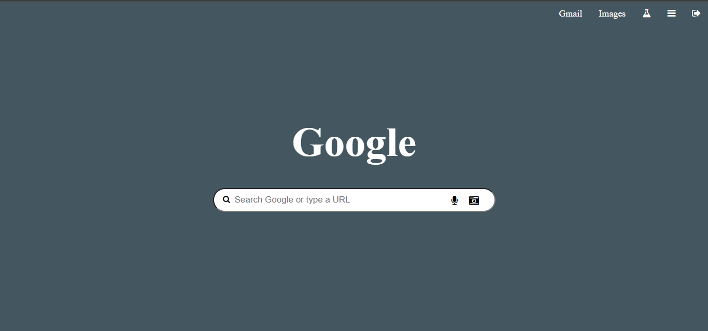

# Google Homepage Clone

This is a clone of the Google homepage created using HTML and CSS. The project aims to replicate the layout and design of the Google homepage, providing a simple and responsive interface.

## Features

- **Search Bar**: A  search bar similar to the original Google homepage.
- **Logo**: The Google logo is replicated using CSS.
- **Minimalist Layout**: A clean, minimalist layout with essential Google homepage features.

## Technologies Used

- **HTML**: Structure of the webpage.
- **CSS**: Styling for layout, search bar, and other elements to match Google’s design.

